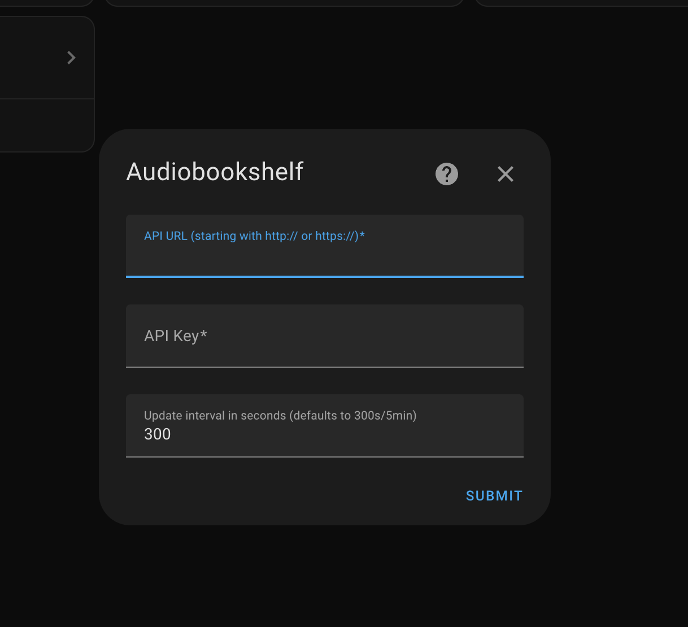

# Audiobookshelf

[![GitHub Release][releases-shield]][releases]
[![GitHub Activity][commits-shield]][commits]
[![License][license-shield]](LICENSE)

[![pre-commit][pre-commit-shield]][pre-commit]
[![Black][black-shield]][black]

[![Project Maintenance][maintenance-shield]][user_profile]
[![BuyMeCoffee][buymecoffeebadge]][buymecoffee]

**This component will set up the following sensors.**

| Entity          |       Type       | Description                          |
| --------------- | ---------------- | ------------------------------------ |
| `connectivity`  | `binary_sensor`  | Show whether the server is connected |
| `open_sessions` | `sensor`         | Show number of open audio sessions   |
| `libraries`     | `sensor`         | Number of libraries on the server    |

## Installation

### Manual installation

1. Using the tool of choice open the directory (folder) for your HA configuration (where you find `configuration.yaml`).
2. If you do not have a `custom_components` directory (folder) there, you need to create it.
3. In the `custom_components` directory (folder) create a new folder called `audiobookshelf`.
4. Download _all_ the files from the `custom_components/audiobookshelf/` directory (folder) in this repository.
5. Place the files you downloaded in the new directory (folder) you created.
6. Restart Home Assistant
7. In the HA UI go to "Configuration" -> "Integrations" click "+" and search for "Audiobookshelf"

## Configuration

### Getting an access token

1. Log in as the admin user
2. Go to Settings > Users
3. Click on the account
4. Copy the API Token from beneath the user's name

For more info on what the token can be used for see: https://api.audiobookshelf.org/#introduction

### Setting up via the UI

## Credits

This project was generated from [@oncleben31](https://github.com/oncleben31)'s [Home Assistant Custom Component Cookiecutter](https://github.com/oncleben31/cookiecutter-homeassistant-custom-component) template.

Code template was mainly taken from [@Ludeeus](https://github.com/ludeeus)'s [integration_blueprint][integration_blueprint] template

---

[integration_blueprint]: https://github.com/custom-components/integration_blueprint
[black]: https://github.com/psf/black
[black-shield]: https://img.shields.io/badge/code%20style-black-000000.svg?style=for-the-badge
[buymecoffee]: https://www.buymeacoffee.com/wolffshots
[buymecoffeebadge]: https://img.shields.io/badge/buy%20me%20a%20coffee-donate-yellow.svg?style=for-the-badge
[commits-shield]: https://img.shields.io/github/commit-activity/y/wolffshots/hass-audiobookshelf.svg?style=for-the-badge
[commits]: https://github.com/wolffshots/hass-audiobookshelf/commits/main
[license-shield]: https://img.shields.io/github/license/wolffshots/hass-audiobookshelf.svg?style=for-the-badge
[maintenance-shield]: https://img.shields.io/badge/maintainer-%40wolffshots-blue.svg?style=for-the-badge
[pre-commit]: https://github.com/pre-commit/pre-commit
[pre-commit-shield]: https://img.shields.io/badge/pre--commit-enabled-brightgreen?style=for-the-badge
[releases-shield]: https://img.shields.io/github/release/wolffshots/hass-audiobookshelf.svg?style=for-the-badge
[releases]: https://github.com/wolffshots/hass-audiobookshelf/releases
[user_profile]: https://github.com/wolffshots
