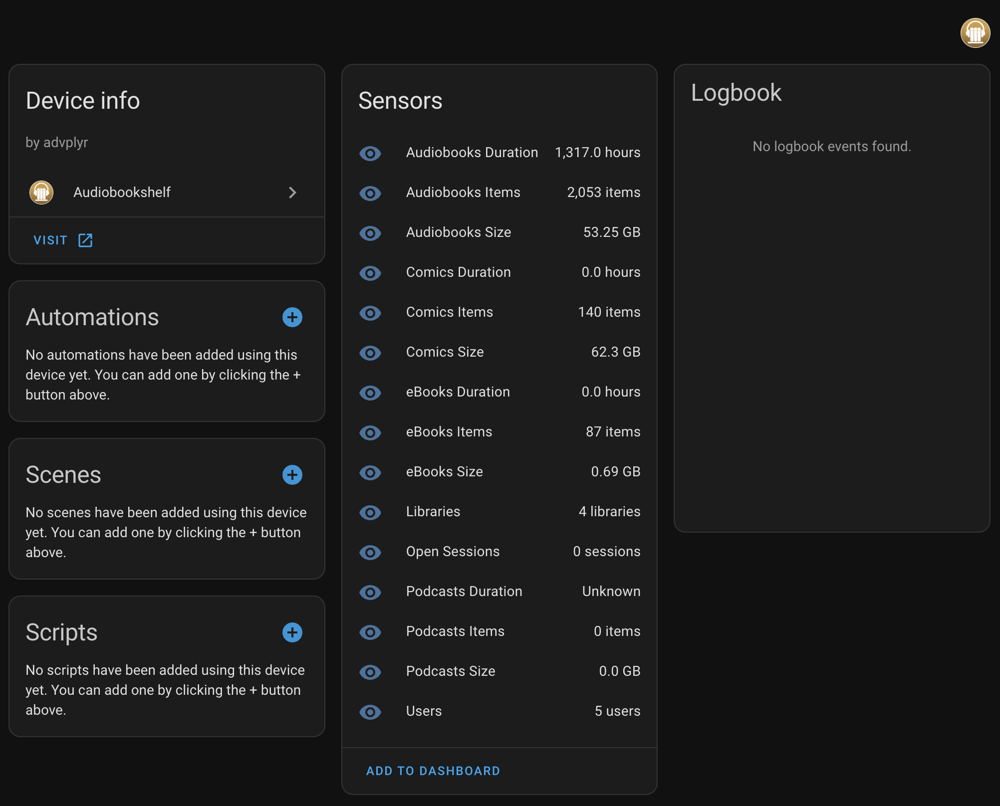
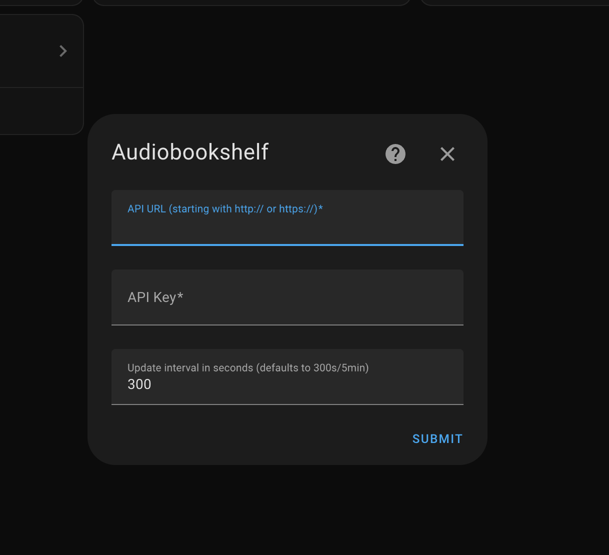

# Audiobookshelf

[![GitHub Release][releases-shield]][releases]
[![GitHub Activity][commits-shield]][commits]
[![License][license-shield]](LICENSE)

[![pre-commit][pre-commit-shield]][pre-commit]
[![Black][black-shield]][black]

[![Project Maintenance][maintenance-shield]][user_profile]
[![BuyMeCoffee][buymecoffeebadge]][buymecoffee]

## This component will set up the following general sensors:

| Entity                                  |  Type    | Description                                            |
| --------------------------------------- | -------- | ------------------------------------                   |
| `sensor.audiobookshelf_open_sessions`   | `sensor` | Number of open audio sessions                          |
| `sensor.audiobookshelf_recent_sessions` | `sensor` | Number of open audio sessions updated in the last two minutes |
| `sensor.audiobookshelf_libraries`       | `sensor` | Number of libraries on the server                      |
| `sensor.audiobookshelf_users`           | `sensor` | Number of users on the server                          |
| `sensor.audiobookshelf_users_online`    | `sensor` | Number of online users on the server                   |
| `sensor.audiobookshelf_auth_sessions`   | `sensor` | Number of active authentication sessions for the configured user (requires Audiobookshelf v2.36.0+, otherwise `unknown`) |

## It also adds the following library specific sensors (for each library that it finds during setup):
| Entity                                       | Type     | Description                                        |
| -------------------------------------------- | -------- | -------------------------------------------------- |
| `sensor.audiobookshelf_<library>_items`      | `sensor` | Number of items in the library                     |
| `sensor.audiobookshelf_<library>_duration`   | `sensor` | Total playable content in the library, shown in hours by default |
| `sensor.audiobookshelf_<library>_size`       | `sensor` | Total disk space used by the library, shown in GB by default |

Library sensors are created for the libraries that exist when the integration starts. Reload the integration after adding or removing a library on the server, otherwise the new library is counted by `sensor.audiobookshelf_libraries` without getting sensors of its own.

## Actions

### `audiobookshelf.remove_my_progress`

Removes listening progress from every book whose series name matches the text you give it. **This cannot be undone.**

| Field         | Required | Description                                                                              |
| ------------- | -------- | ---------------------------------------------------------------------------------------- |
| `series_name` | yes      | Matched as a substring against each book's series name, ignoring case. Cannot be blank.  |

Two things are worth knowing before using it:

- It removes progress for **the account the API key belongs to**, not for the Home Assistant user calling the action. The name is misleading in that respect.
- The match is a substring, so `Dune` also matches `Dune Chronicles`. Give as much of the series name as you can.

It walks every item in every library, so it can take a while on a large server. Podcast libraries are unaffected.

## Examples

## Installation

### Installation with HACS

1. Make sure you have HACS fully set up (if you don't you can do so [here](https://hacs.xyz/docs/use/))
2. Open up HACS in you Home Assistant instance and search for "Audiobookshelf" and add it
3. Restart Home Assistant once it is installed
4. In the Home Assistant UI go to "Configuration" -> "Integrations" click "+" and search for "Audiobookshelf"
5. Click on "Audiobookshelf" and proceed to [Configuration](#configuration)

### Manual installation

1. Using the tool of choice open the directory (folder) for your Home Assistant configuration (where you find `configuration.yaml`)
2. If you do not have a `custom_components` directory (folder) there, you need to create it
3. Download the `Audiobookshelf_vX.X.X.zip` file from the [latest release](https://github.com/wolffshots/hass-audiobookshelf/releases/latest)
4. Unzip the folder and place it into `custom_components`
5. Restart Home Assistant
6. In the Home Assistant UI go to "Configuration" -> "Integrations" click "+" and search for "Audiobookshelf"
7. Click on "Audiobookshelf" and proceed to [Configuration](#configuration)

## Configuration

### Getting an API key

The integration reads server-wide user and session data, so the credential has to belong to an **admin** user.

1. Log in as an admin user
2. Go to Settings > API Keys
3. Create a new API key (give it a name and, optionally, an expiry)
4. Copy the key straight away - it is only shown once, when it is created

Use that key as the `API key` when setting up the integration.

**API Keys require Audiobookshelf v2.26.0 or newer.** On older servers you still have to use the legacy API token: go to Settings > Users, click on the admin account and copy the token from beneath the user's name. Legacy tokens are deprecated - from v2.26.0 Audiobookshelf labels that field "Legacy API Token" and warns that it will be removed in the future - so move to an API key once your server has been updated.

For more info on what the key can be used for see: https://api.audiobookshelf.org/#introduction

### Setting up via the UI

| Variable        | Description                                                                                               |
| --------------- | --------------------------------------------------------------------------------------------------------- |
| `URL`           | The URL and port of your Audiobookshelf instance (must start with the protocol, http:// or https://)      |
| `API key`       | The API key that you got in the previous step                                                             |
| `Scan interval` | How regularly the data should be fetched from your Audiobookshelf instance (in seconds), defaults to 300s |

Only one Audiobookshelf server can be configured at a time. To point the integration at a different server, remove the existing entry first.

## Credits

This project was generated from [@oncleben31](https://github.com/oncleben31)'s [Home Assistant Custom Component Cookiecutter](https://github.com/oncleben31/cookiecutter-homeassistant-custom-component) template.

Code template was mainly taken from [@Ludeeus](https://github.com/ludeeus)'s [integration_blueprint][integration_blueprint] template

---

[integration_blueprint]: https://github.com/custom-components/integration_blueprint
[black]: https://github.com/psf/black
[black-shield]: https://img.shields.io/badge/code%20style-black-000000.svg?style=for-the-badge
[buymecoffee]: https://www.buymeacoffee.com/wolffshots
[buymecoffeebadge]: https://img.shields.io/badge/buy%20me%20a%20coffee-donate-yellow.svg?style=for-the-badge
[commits-shield]: https://img.shields.io/github/commit-activity/y/wolffshots/hass-audiobookshelf.svg?style=for-the-badge
[commits]: https://github.com/wolffshots/hass-audiobookshelf/commits/main
[license-shield]: https://img.shields.io/github/license/wolffshots/hass-audiobookshelf.svg?style=for-the-badge
[maintenance-shield]: https://img.shields.io/badge/maintainer-%40wolffshots-blue.svg?style=for-the-badge
[pre-commit]: https://github.com/pre-commit/pre-commit
[pre-commit-shield]: https://img.shields.io/badge/pre--commit-enabled-brightgreen?style=for-the-badge
[releases-shield]: https://img.shields.io/github/release/wolffshots/hass-audiobookshelf.svg?style=for-the-badge
[releases]: https://github.com/wolffshots/hass-audiobookshelf/releases
[user_profile]: https://github.com/wolffshots
