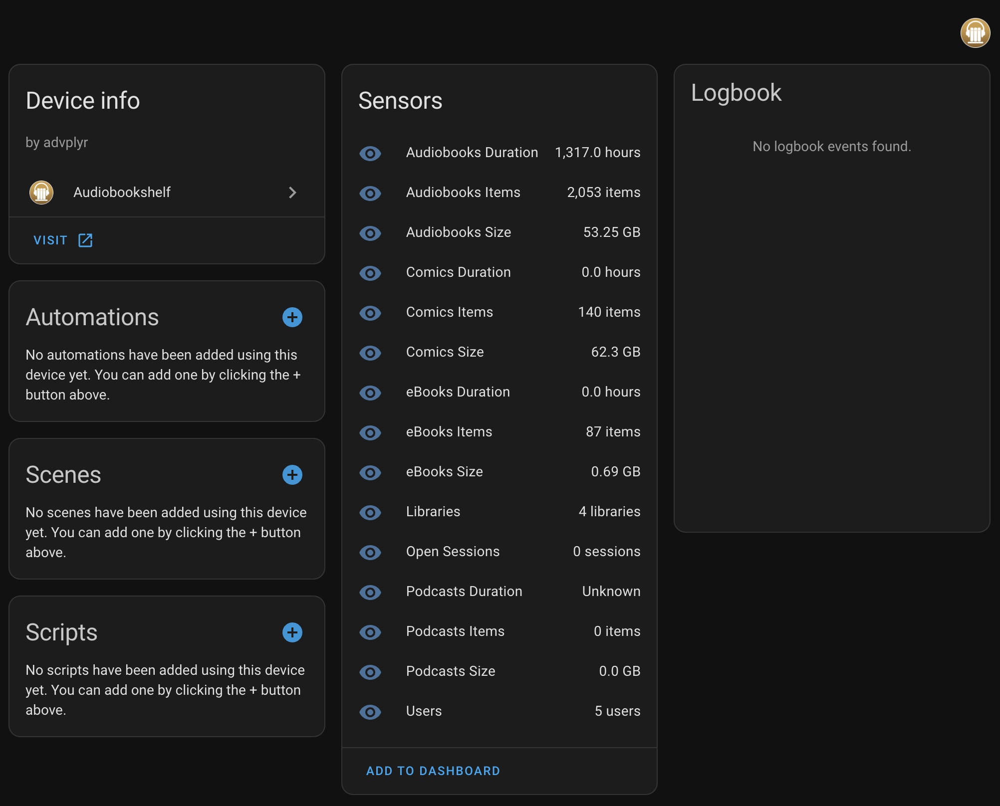

[![GitHub Release][releases-shield]][releases]
[![GitHub Activity][commits-shield]][commits]
[![License][license-shield]](LICENSE)

[![hacs][hacsbadge]][hacs]
[![Project Maintenance][maintenance-shield]][user_profile]
[![BuyMeCoffee][buymecoffeebadge]][buymecoffee]

## This component will set up the following general sensors:

| Entity            |       Type       | Description                                            |
| ---------------   | ---------------- | ------------------------------------                   |
| `open_sessions`   | `sensor`         | Show number of open audio sessions                     |
| `recent_sessions` | `sensor`         | Show number of open audio sessions updated recently    |
| `libraries`       | `sensor`         | Number of libraries on the server                      |
| `users`           | `sensor`         | Number of users on the server                          |
| `online_users`    | `sensor`         | Number of online users on the server                   |

## It also adds the following library specific sensors (for each library that it finds during setup):
| Entity             | Type           | Description                                              |
| ------------------ | -------------- | -------------------------------------------------------- |
| `items`            | `sensor`       | Number of items in the library                           |
| `duration`         | `sensor`       | Total time in hours of playable content in library       |
| `size`             | `sensor`       | Total disk space used by library in GB                   |

## Examples



## Installation

### Installation with HACS

1. Make sure you have HACS fully set up (if you don't you can do so [here](https://hacs.xyz/docs/use/))
2. Open up HACS in you Home Assistant instance and search for "Audiobookshelf" and add it
3. Restart Home Assistant once it is installed
4. In the Home Assistant UI go to "Configuration" -> "Integrations" click "+" and search for "Audiobookshelf"
5. Click on "Audiobookshelf" and proceed to [Configuration](#configuration)

### Manual installation

1. Using the tool of choice open the directory (folder) for your Home Assistant configuration (where you find `configuration.yaml`)
2. If you do not have a `custom_components` directory (folder) there, you need to create it
3. Download the `Audiobookshelf_vX.X.X.zip` file from the [latest release](https://github.com/wolffshots/hass-audiobookshelf/releases/latest)
4. Unzip the folder and place it into `custom_components`
5. Restart Home Assistant
6. In the Home Assistant UI go to "Configuration" -> "Integrations" click "+" and search for "Audiobookshelf"
7. Click on "Audiobookshelf" and proceed to [Configuration](#configuration)



## Configuration

### Getting an access token

1. Log in as the admin user
2. Go to Settings > Users
3. Click on the account
4. Copy the API Token from beneath the user's name

For more info on what the token can be used for see: https://api.audiobookshelf.org/#introduction

### Setting up via the UI

## Credits

This project was generated from [@oncleben31](https://github.com/oncleben31)'s [Home Assistant Custom Component Cookiecutter](https://github.com/oncleben31/cookiecutter-homeassistant-custom-component) template.

Code template was mainly taken from [@Ludeeus](https://github.com/ludeeus)'s [integration_blueprint][integration_blueprint] template

---

[integration_blueprint]: https://github.com/custom-components/integration_blueprint
[buymecoffee]: https://www.buymeacoffee.com/wolffshots
[buymecoffeebadge]: https://img.shields.io/badge/buy%20me%20a%20coffee-donate-yellow.svg?style=for-the-badge
[commits-shield]: https://img.shields.io/github/commit-activity/y/wolffshots/hass-audiobookshelf.svg?style=for-the-badge
[commits]: https://github.com/wolffshots/hass-audiobookshelf/commits/main
[hacs]: https://hacs.xyz
[hacsbadge]: https://img.shields.io/badge/HACS-Custom-orange.svg?style=for-the-badge
[license]: https://github.com/wolffshots/hass-audiobookshelf/blob/main/LICENSE
[license-shield]: https://img.shields.io/github/license/wolffshots/hass-audiobookshelf.svg?style=for-the-badge
[maintenance-shield]: https://img.shields.io/badge/maintainer-%40wolffshots-blue.svg?style=for-the-badge
[releases-shield]: https://img.shields.io/github/release/wolffshots/hass-audiobookshelf.svg?style=for-the-badge
[releases]: https://github.com/wolffshots/hass-audiobookshelf/releases
[user_profile]: https://github.com/wolffshots
